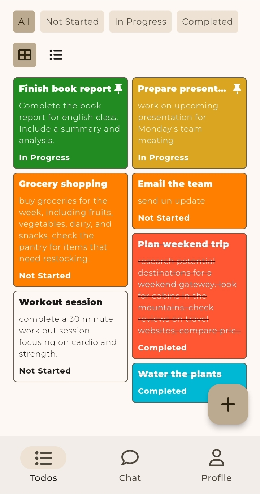
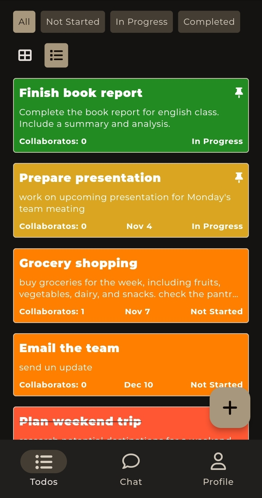
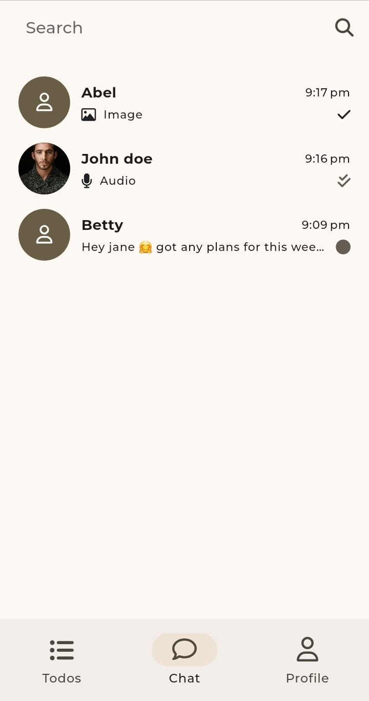
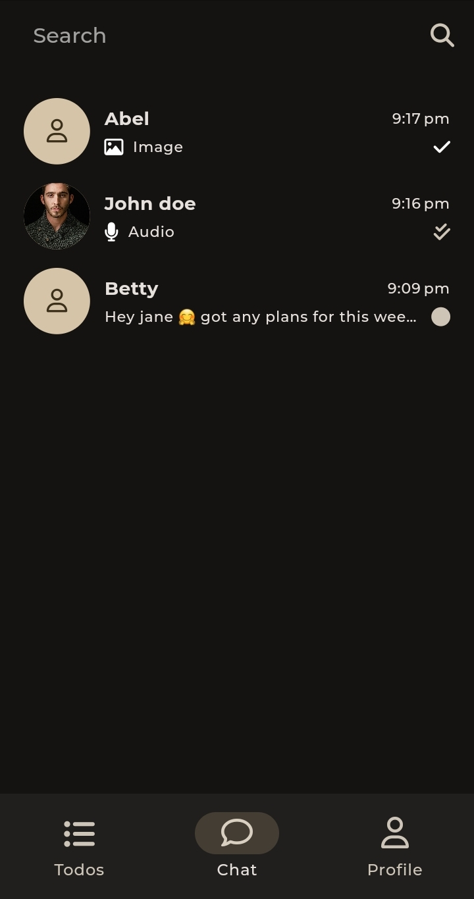
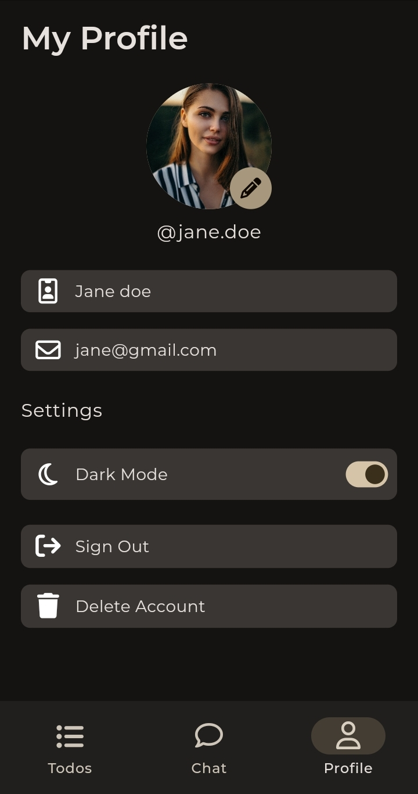
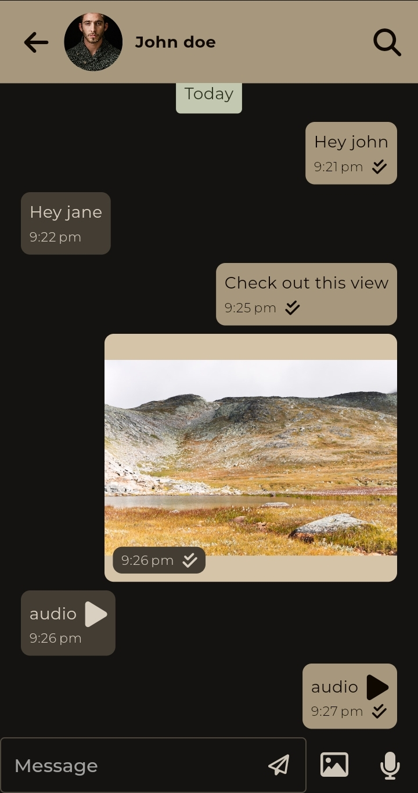
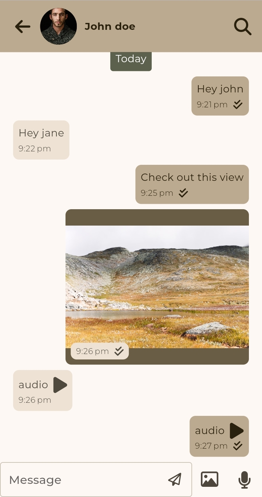
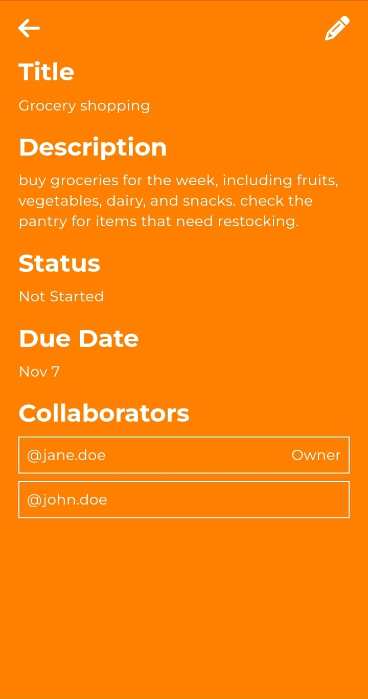

# Todo 📋💬

A collaborative todo app that enables users to create, manage, and collaborate on to-dos. With built-in one-on-one chat functionality, communication is simplified, allowing for seamless task coordination and discussions.

## Features

- **Collaborative To-Dos**: Create and edit to-dos in real-time, allowing collaborators to stay up-to-date.
- **To-Do Status Tracking**: Mark to-dos as "Not Started" "In Progress," or "Completed" to keep track of progress.
- **One-on-One Chat**: Directly chat with members within the app, with support for sending text, images, and audio messages for enhanced communication.
- **Dark Mode**: Switch between light and dark themes for a personalized experience.

## Technology Stack

- **Frontend**: Flutter
- **Backend**: Firebase (Firebase Auth for authentication, Firebase Cloud Firestore for database, Firebase Storage for storage)
- **State Management**: Riverpod

## Screenshots

| Light                                                 | Dark                                                  |
| ----------------------------------------------------- | ---------------------------------------------------   |
|   |   |
|   |   |
|   |   |
|   |   |
|   |  |
